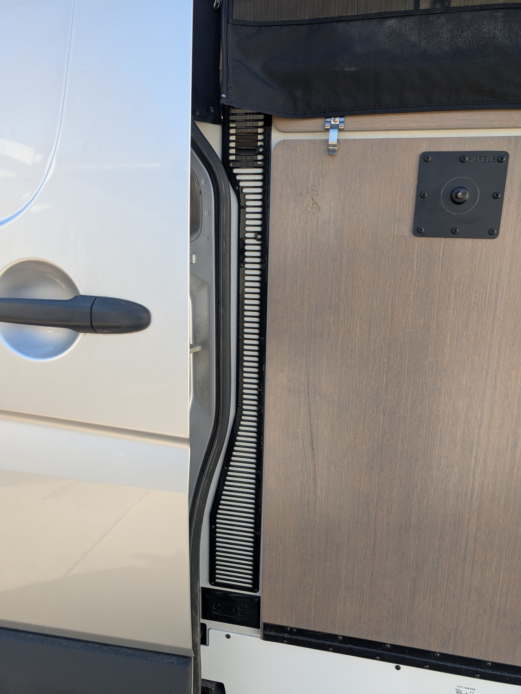
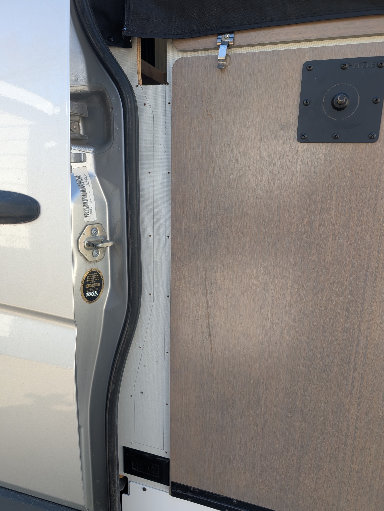
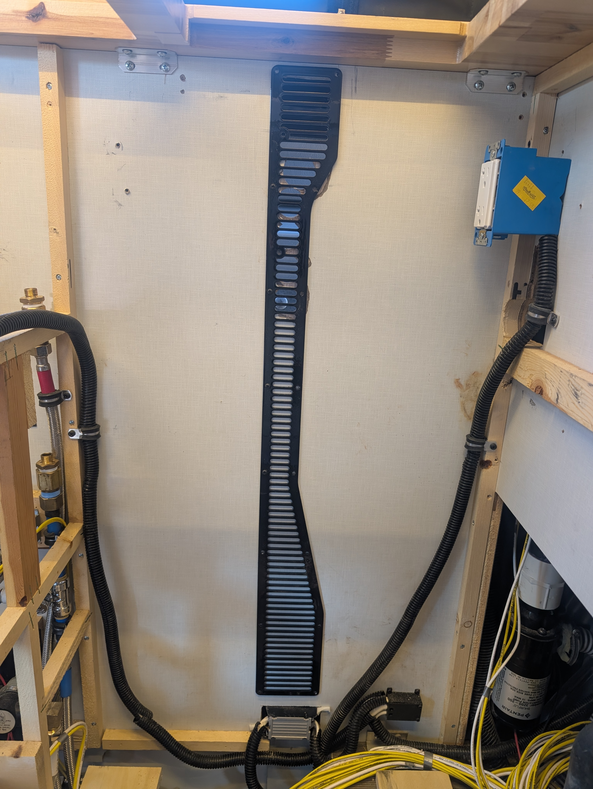
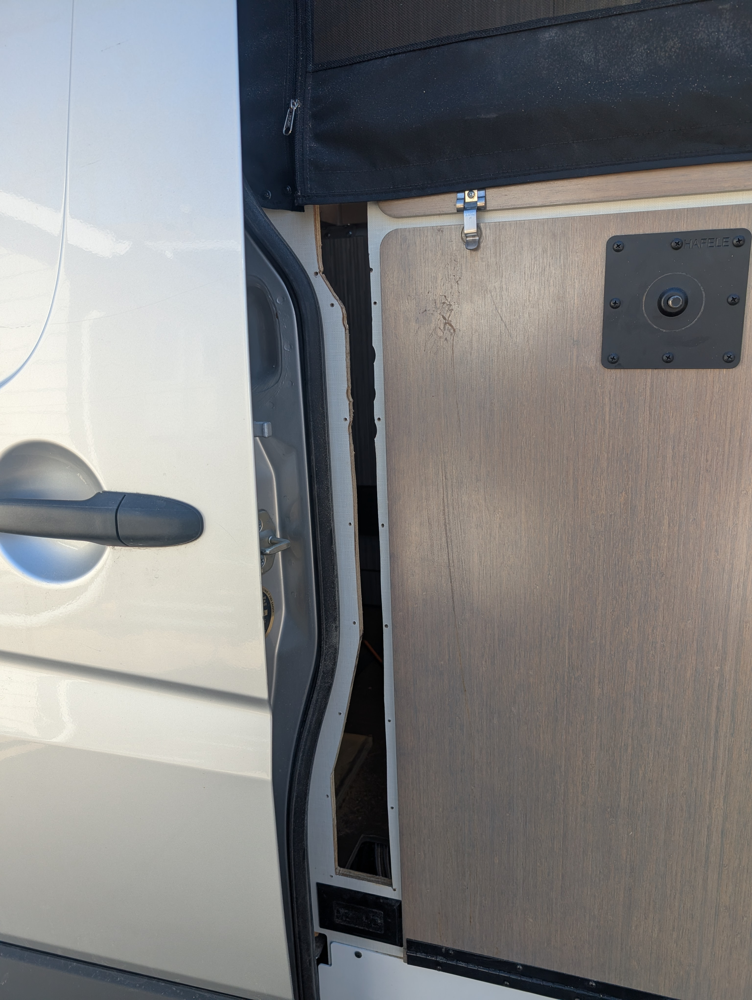
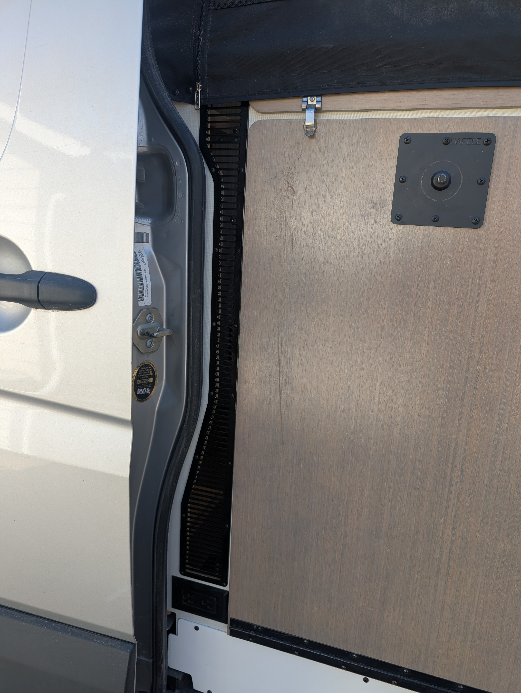

# 2018-2020 Winnebago Revel Extra Large Kitchen Galley Rear Vent

### Tools Needed:

### Brackets and fasteners included in the kit:

1. Position the vent. The right edge of the vent should be just under 1/4 inch spaced away from the table. The top edge of the vent should be 3/16 of an inch below the bottom of the countertop.

