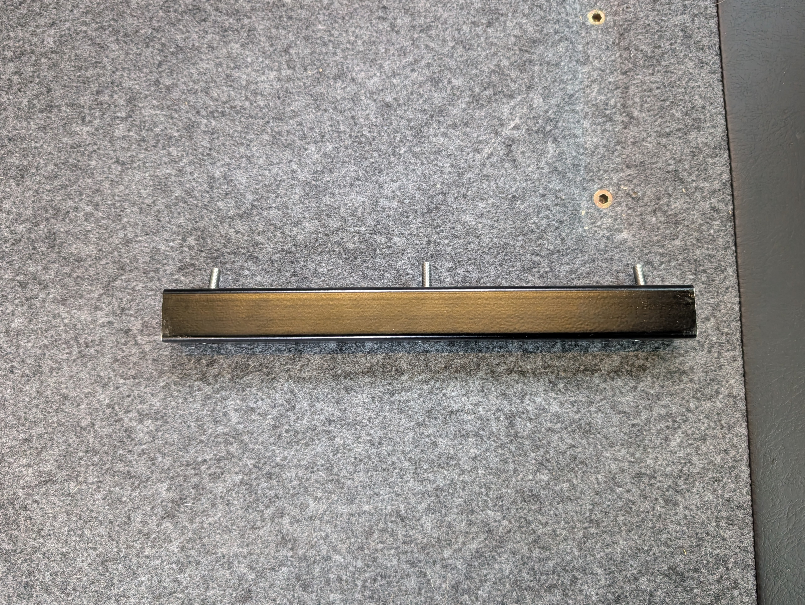

# 2018-2020 Winnebago Revel Front Bed Support

### Tools Needed:

- Impact driver or drill
- 1/4" Hex to 3/8" Socket Adapter
- Hex Socket Set
- Hex Key Set

### Brackets and fasteners included in the kit:
- Revel Front Bed Support bracket
- 8x - Hex-Drive Flat Head Machine Screws 
- 8x - Threaded Inserts for Wood

1. Uninstall the original square tube (used to align the main cushion) and the original bed support.
2. Prepare your impact driver or drill, hex socket adapter, and hex socket.

3. Align the threaded inserts with the first hole and some force, press while pulling the trigger of the impact driver or drill, drive the threaded insert in until it is flush. Install the remaining 7 (2 more for the square tube and 5 more for the support bracket).

4. Insert the Hex-Drive Flat Head Machine Screws into the square tube using an hex key to help guide it in.

