# 2018-2020 Winnebago Revel Kitchen Galley Microwave Install Instructions

### Tools Needed:

- Adjustable wrench (not pictured)
- Drill (not pictured)
- Drill bits (not pictured)
- Impact driver with philips bit or Philips screw driver 
- Oscillating tool
- Jigsaw
- Palm sander (not pictured)
- Vacuum
- Bottle jack
- Light (optional)
- 90 degree impact tool (optional)

### Brackets and fasteners included in the kit:

- Microwave bezel bracket
- Microwave shelf bracket
- Induction cooktop spacer
- Induction cooktop mount brackets
- Kitchen Galley vent bracket
- 8x - self tapping countersunk head screws (for shelf)
- 4x - self tapping cap head screws (for induction cooktop mounts)
- 15x - self tapping cap head screws (for microwave bezel)
- 2x - philips machine screws (for macerator switch)
- 2x - machine nuts (for macerator switch)
- Rubber with adhesive backing
- 2x - cam buckle tie down straps

## Installation:

1. Remove the fridge door top fastener.

2. Tilt the fridge door forward and lift it off the bottom hinge.

3. Remove the four caps and screws from the front left and right sides of the fridge.

4. Begin removing the fridge.
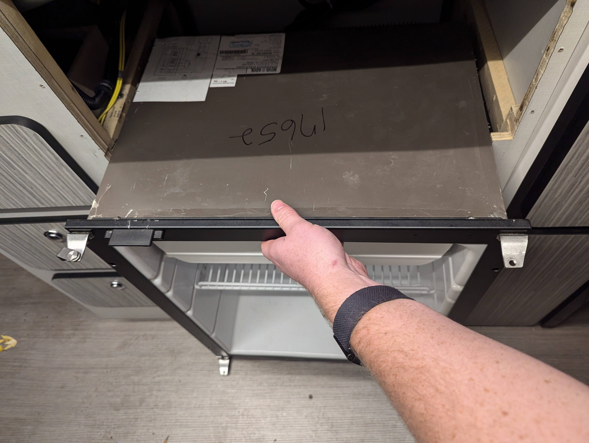

5. Disconnect the fridge wiring.
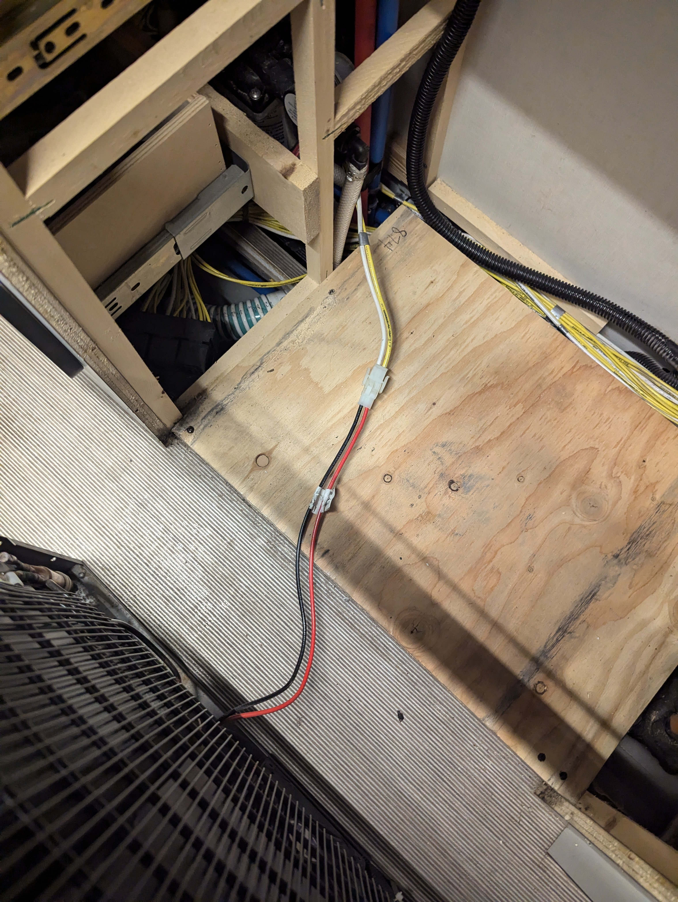

6. On the underside of the induction cooktop, remove the four machine screws (these will be used later) between the induction cooktop bracket and the induction cooktop, then remove four screws between the induction cooktop bracket and the kitchen galley. Remove the induction cooktop.

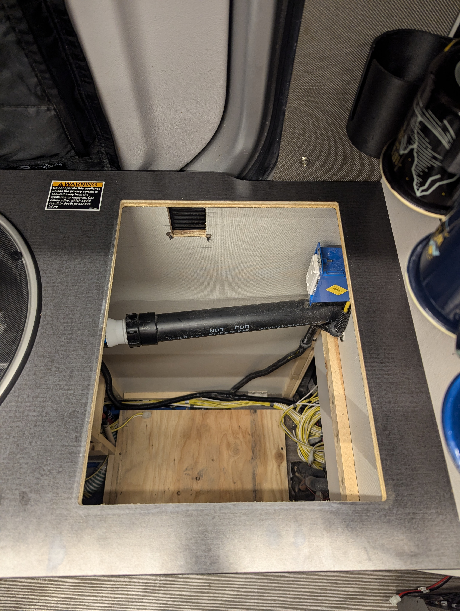

7. **If you don't feel comfortable with this step, hire an electrician. I am not an electrician, so take everything I say with a grain of salt.** For outlets in the 2018-2020 Revels, there should be only two outlet circuits; one 15 amp circuit for all the outlets in the van except the induction cooktop outlet and one 20 amp circuit for the induction cooktop outlet. In my install, I replaced the induction cooktop outlet (which surprisingly was a 15 amp outlet, I believe this was a mistake on Winnebago's side) with a residential 20 amp outlet; this is a 20 amp circuit, everything on it should be rated for 20 amps. I switched to an outlet that allows me to run the induction cooktop and microwave off the same outlet. It may be possible to mount the 15 amp outlet that is on the front right of the kitchen galley somewhere inside the kitchen galley to avoid adjusting this circuit. It is also possible to do this and connect the microwave to that circuit. Another option which Tony Loeza did, was to relocate the 15 amp outlet to the back side of the kitchen galley, next to the fold-down table, near the bottom of the kitchen galley; in hindsight, this is what I would recommend. I personally removed this 15 amp outlet (front right of kitchen galley), but this required me to run a new 14/2 w/ ground from the outlet on the front left of the kitchen galley to the outlets on the passenger side rear of the van, in order to do this you have to remove the lower big plastic panel next to the bed on the passenger side of the van and in order to remove the lower you have to remove the upper plastic panel.
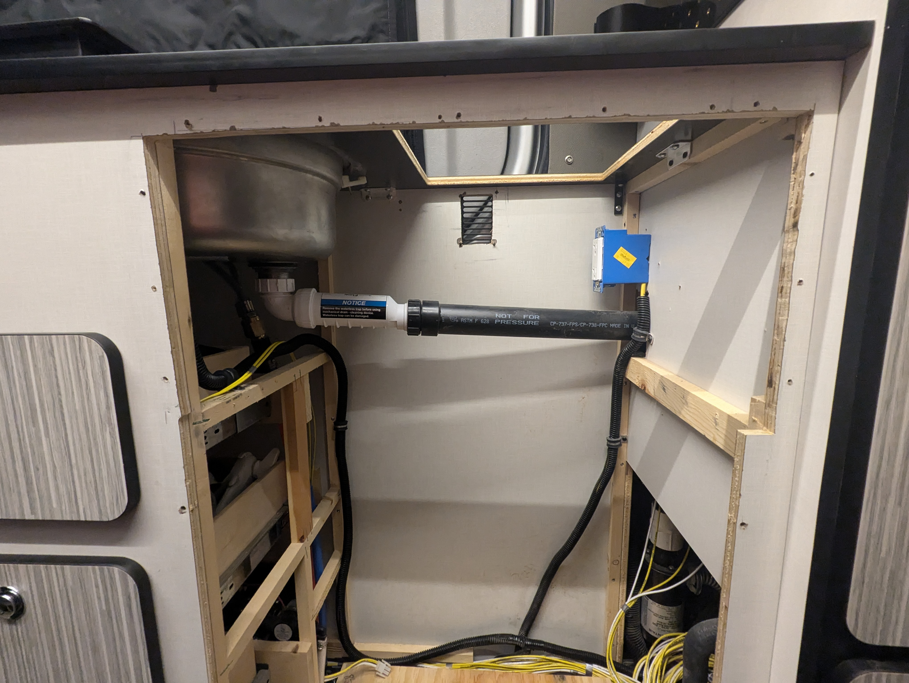

8. You will need to cut an opening for the microwave. I would recommend first marking a line for the opening and conservatively remove material. You can always remove more material, but you can't add it back. I cut near the line and then later used a palm sander to remove more where needed. Here are some rough dimensions. The left cut will be `1/8 in` (`3.175 mm`) to the right of the cut for the fridge. The right cut will line up with the inner brace of the kitchen galley which is a little under `3/4 in` (`18.6 mm`) from the pantry wall. The top cut will be `1 5/16 in` (`33.5 mm`) below the countertop. You will also need to remove the majority of the front right inner brace. The bumpout on the right side of the microwave near the front ends up in this space.

9. Install the rear vent. Mark the four outer mounting holes. Mark the corners of the top and bottom vent openings and then drawer a line between each corner to form a rectangle of the area you need to remove. You will likely need to use an oscillating tool to cut this opening. If you are able to use a jigsaw, I would recommend drilling each corner using a drill bit larger than the width of your jigsaw blade.
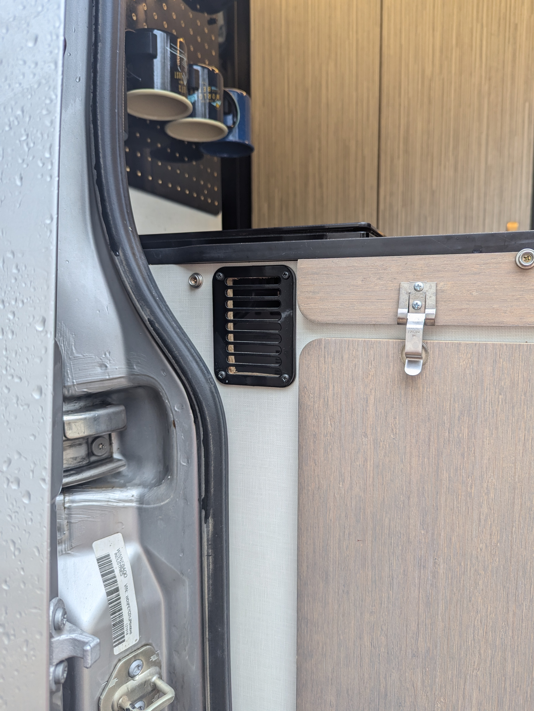

10. Prepare the bottle jack.
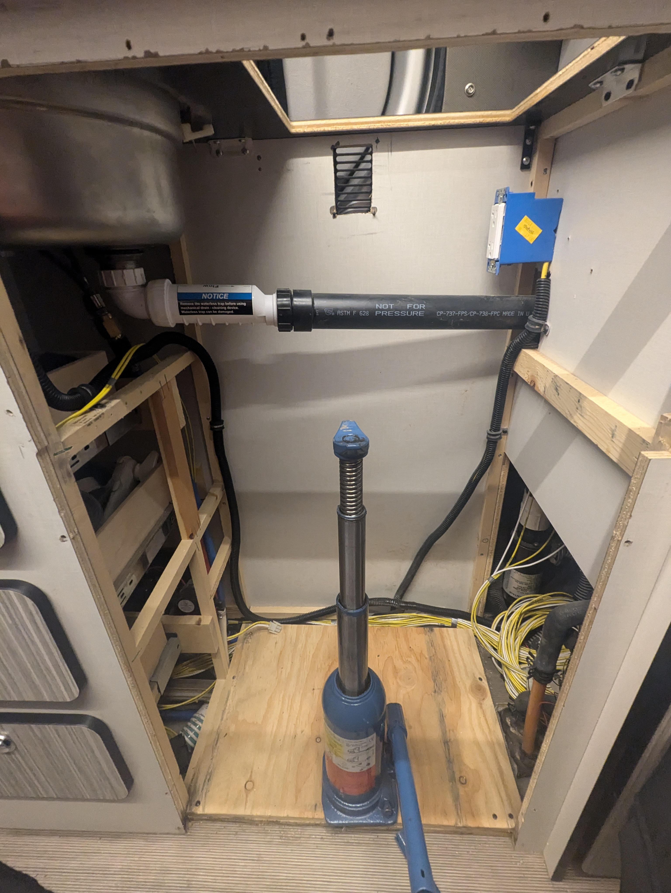

11. Align the microwave shelf.
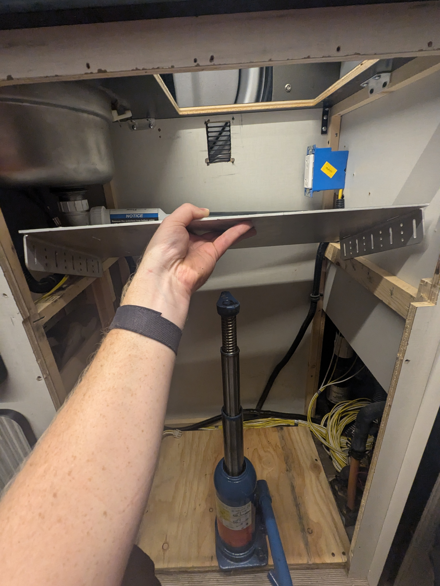

12. Begin test fitting the microwave.
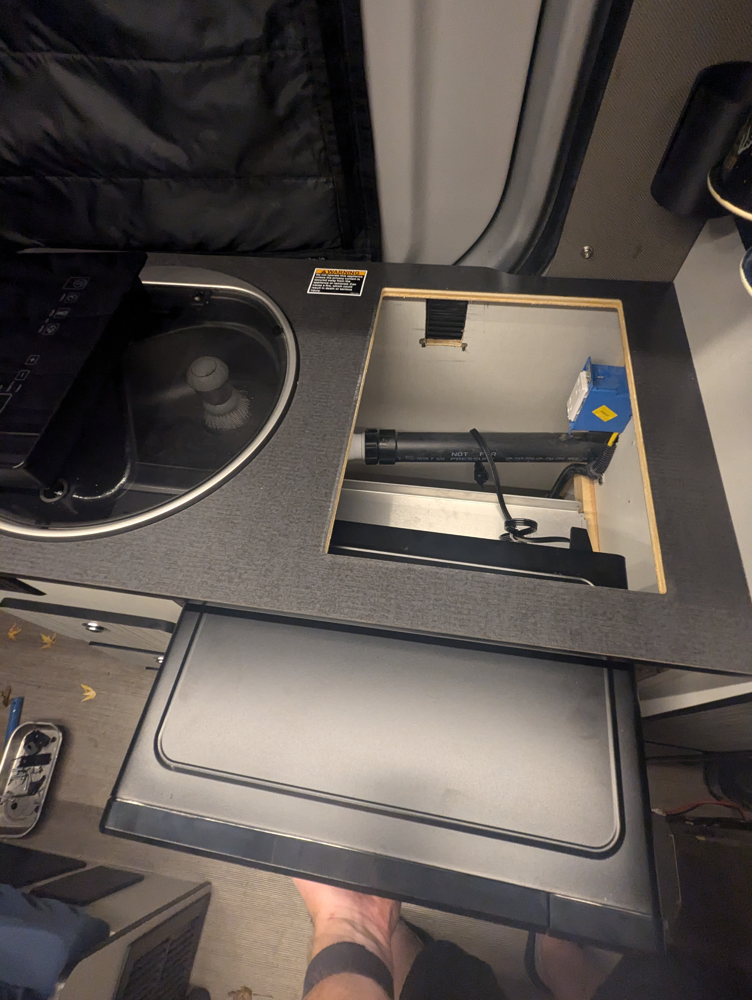

13. Be sure the power cable is clear.

14. Check alignment on the right and top, if you need to remove more material, I would recommend using a palm sander. Once enough material is removed, align the microwave to the front of the kitchen galley, you should have a consistent amount of microwave sticking out (I would recommend 1/16-1/8 of space between the front of the microwave bezel and the microwave door). Once the stick-out is consistent, be sure to slide the microwave shelf forward until the top of the back edge touches the back of the microwave.

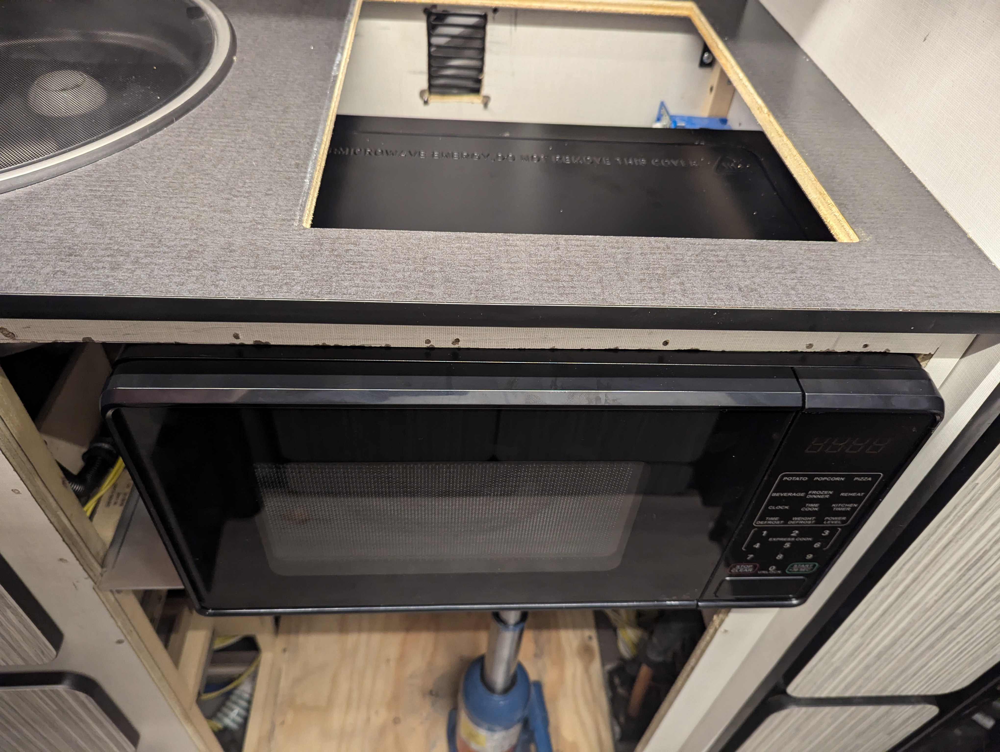

15. On the under side of the shelf, use the screw slots so that you can temporary mount the shelf, allowing you to test fit the fridge. Align the screws so that they do not miss the support that they are screwing into

16. Remove the bottle jack.

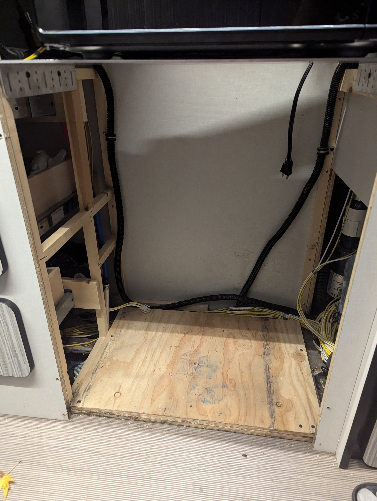

17. Test fit the fridge. This is a tight fit. The fridge will likely bind some, be sure the fridge is going in square; you may need to press from the top and the bottom and wiggle it in.

18. Test fit the microwave bezel.

19. Remove the fridge and microwave to begin test fitting the induction cooktop.
20. Install adhesive rubber on the induction cooktop spacer. (Order: Induction cooktop -> original padding -> 3/8 in. cooktop spacer -> new padding -> countertop)
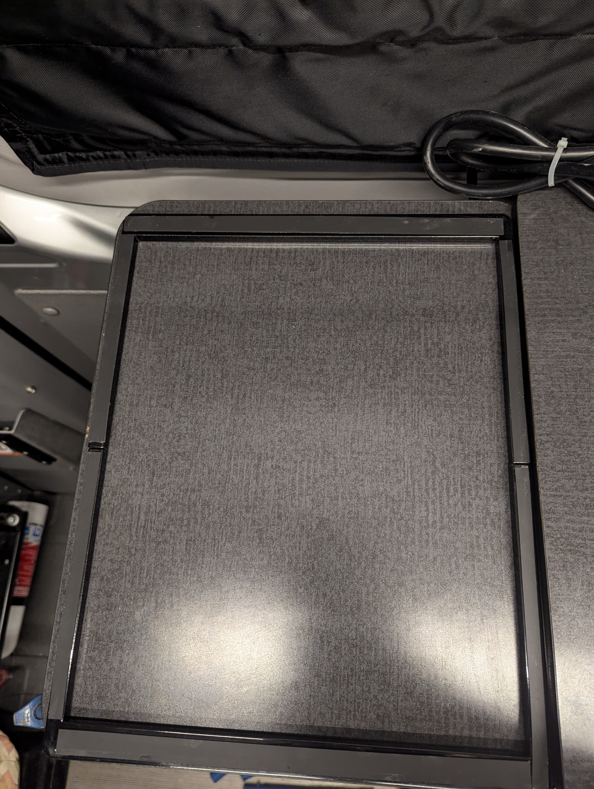

21. Install the induction cooktop spacer with the rubber side down. (Note: The holes in the cooktop spacer are not intended to be used, our manufacturer requires them for their powder coating process.)

22. Get the induction cooktop mounts and fasteners. You will reuse the long machine screws from the original induction cooktop rubber feet (in my testing I was able to thread these in without issue, feel free to thread them in slowly to confirm). These machine screws will be reused for the induction cooktop side of the mounts and the same small self-tapping screws that are used for the microwave bezel will be used for the countertop side of the mount.

23. With the induction cooktop face-down, pick the correct mount to avoid hitting existing cooktop hardward, thread a machine screw through one mount, leave it loose enough that the mount can be moved out of the way for when we flip the cooktop over into the countertop opening. Install the three other mounts following the same steps.

24. Flip the induction cooktop over and put it inside of the countertop opening. From under the countertop, turn the mounts to be pointed to the side of the cooktop, screw down the induction cooktop machine screws until they are tight. Position the cooktop to be centered in the opening. Before screwing into the countertop, be sure you are using the correct screws and they will not poke through the top of the countertop! Install the small self-tapping screws into the countertop side of the mounts, feel free to drill pilot holes, and be careful not to drill or screw through the countertop.

25. Plug in the induction cooktop.

26. Install the microwave shelf straps and microwave. The next few pictures show how to manage the microwave and the straps; it is somewhat tricky to get the straps around the microwave and this is the easiest approach I have found.

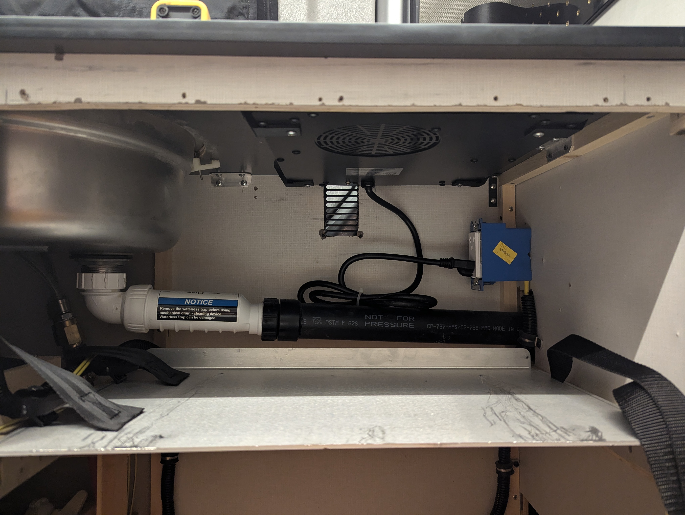

27. Mark the microwave bezel mounting hole locations. (Do not install the fridge yet, disregard the fridge in the image)

28. Remove the microwave and drill pilot holes for the microwave bezel mounting holes. Use a drill bit that is equal to or slightly smaller than the diameter of the screw shank (not the threads). (Do not install the fridge yet, disregard the fridge in the image)

29. Install the macerator switch (using the two machine cap head screws, four washers, and two lock nuts) into the microwave bezel, attach the macerator switch wiring, install the microwave bezel, reinstall the fridge screws/caps (be sure to reconnect the wiring), and install the fridge door.
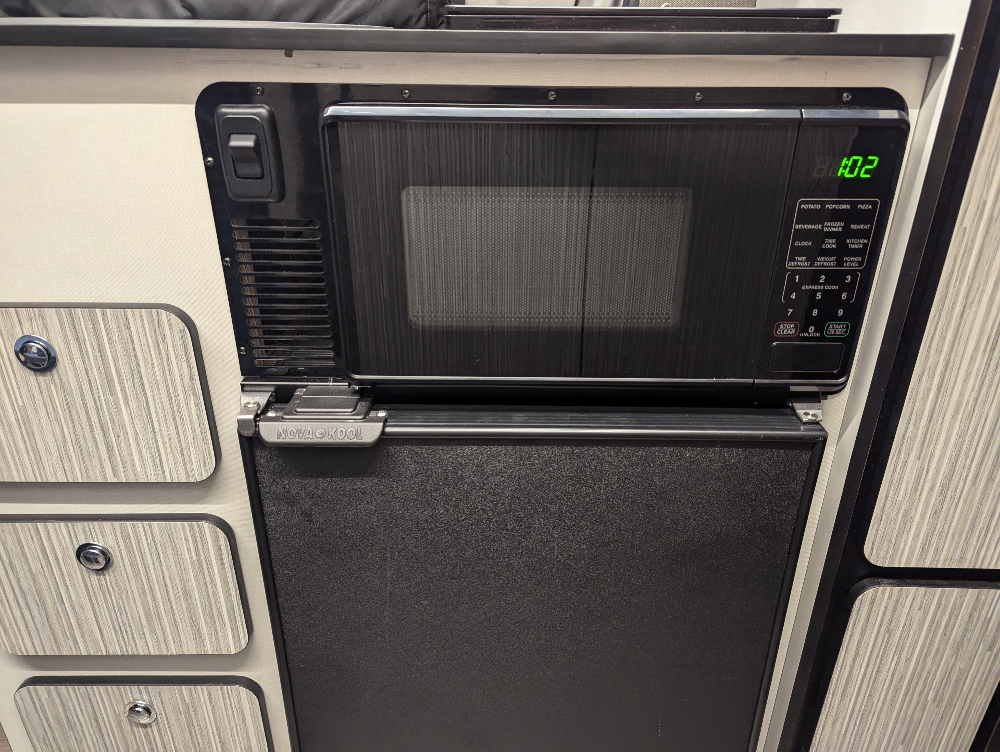

30. You are finished!

