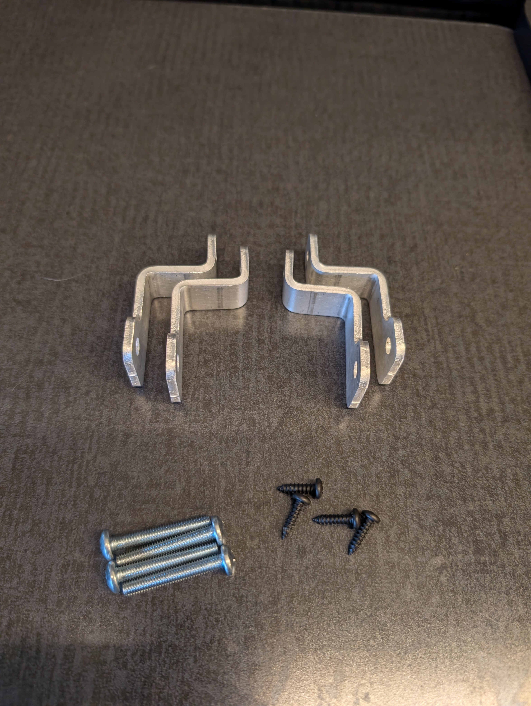

# 2018-2020 Winnebago Revel Kitchen Galley Microwave Install Instructions

### Tools Needed:

- Adjustable wrench (not pictured)
- Drill (not pictured)
- Drill bits (not pictured)
- Impact driver with philips bit or Philips screw driver 
- Oscillating tool
- Jigsaw
- Palm sander (not pictured)
- Bottle jack
- Light (optional)
- 90 degree impact tool (optional)

### Brackets and fasteners included in the kit:

- Microwave bezel bracket
- Microwave shelf bracket
- Induction cooktop spacer
- Induction cooktop mount brackets
- Kitchen Galley vent bracket
- 10x - self tapping countersunk head screws
- 15x - self tapping cap head screws

## Installation:

1. Remove the fridge door top fastener.

2. Tilt the fridge door forward and lift it off the bottom hinge.

3. Set the fridge door to the side.

4. a

5. a

6. a

7. a

8. a

9. a

10. a

11. a

12. a

13. a

14. a

15. a

16. a

17. a

18. a

19. a

20. a

21. a

22. a

23. a

24. a

25. a

26. a

27. a

28. a

29. a

30. a

31. a

32. a

33. a

34. a

35. a

36. a

37. a

38. a

39. a

40. a

41. a

42. a

43. a

44. a

45. a

