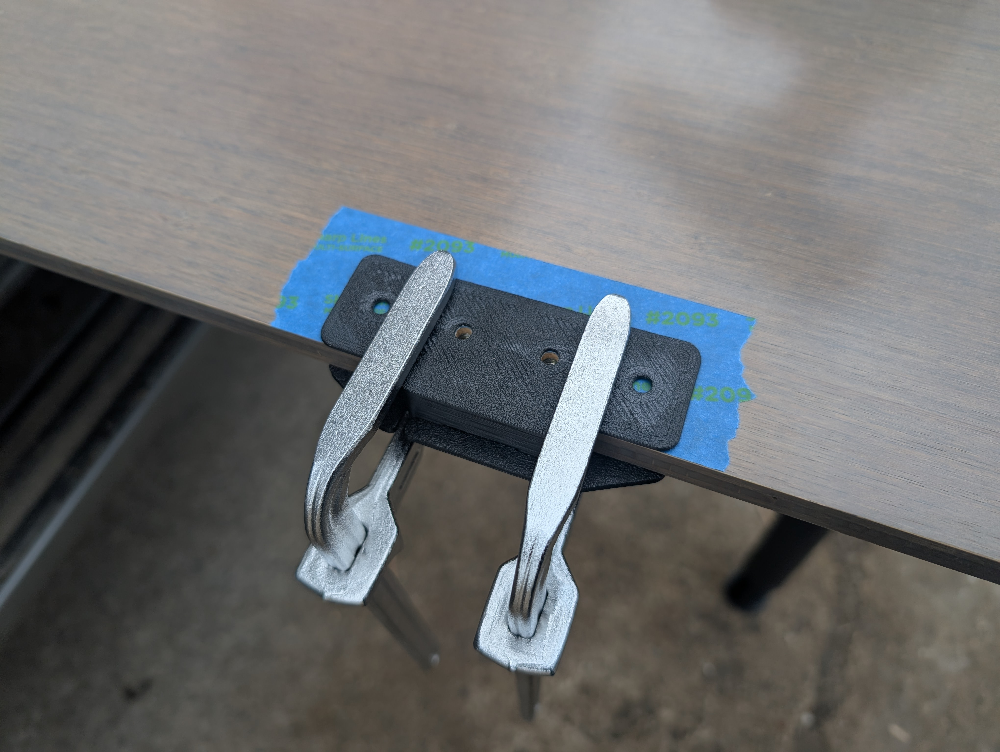
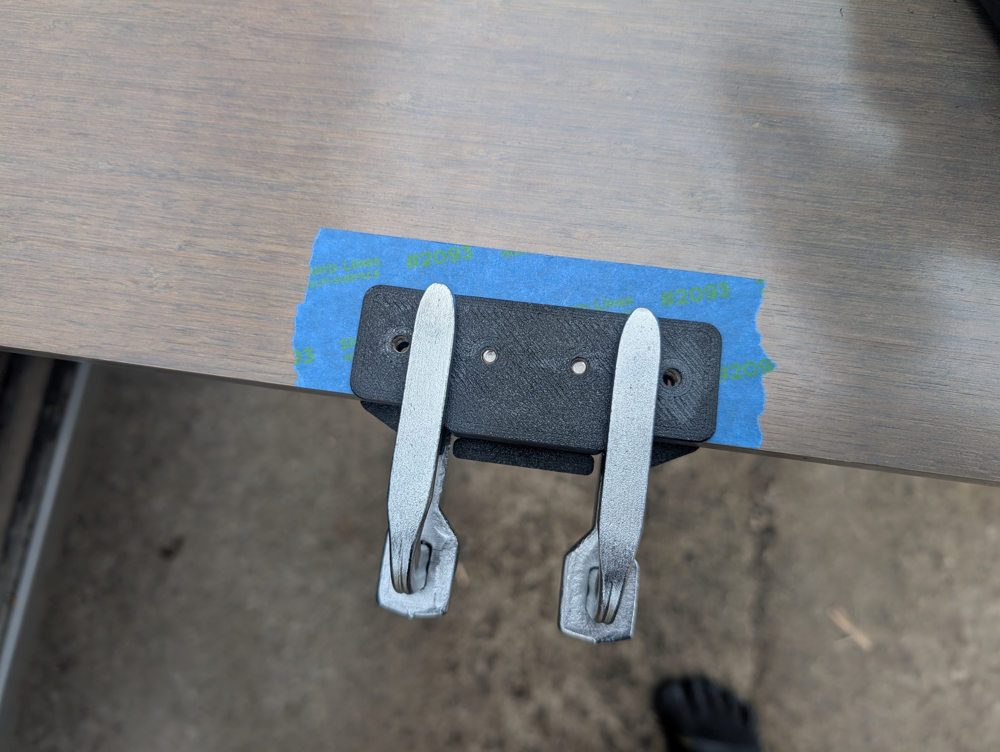
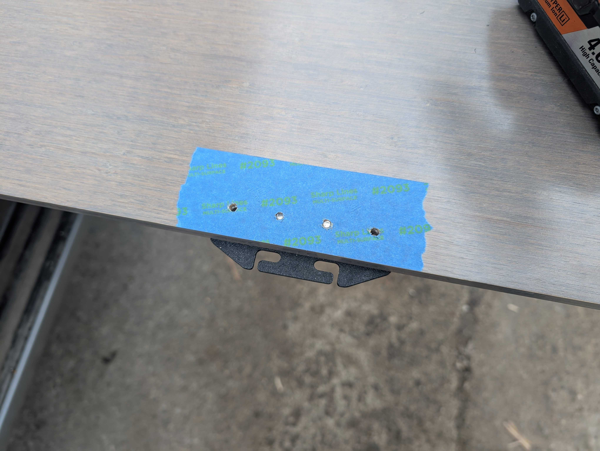
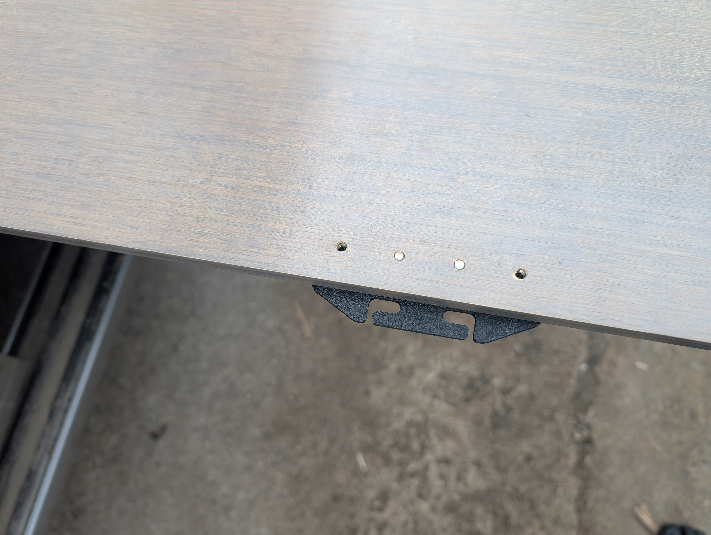
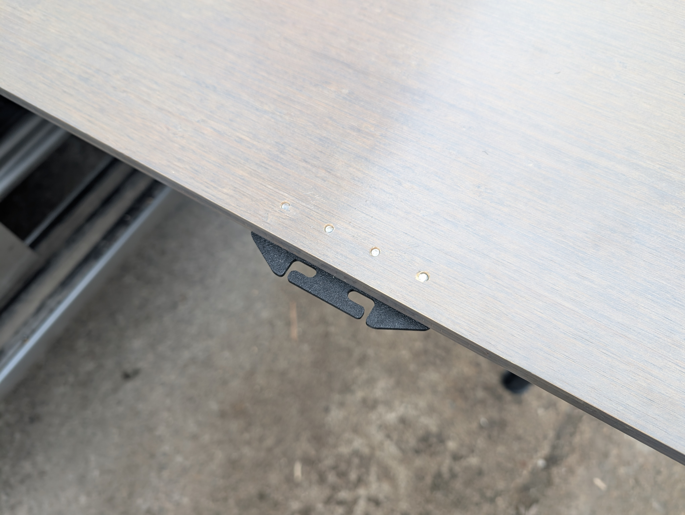
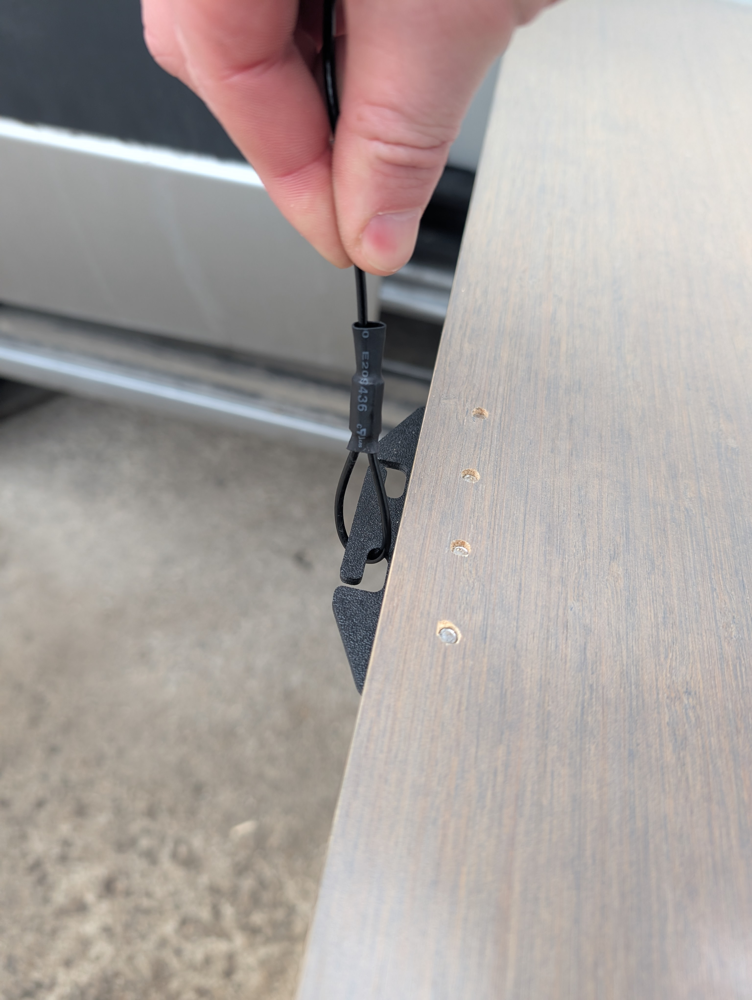
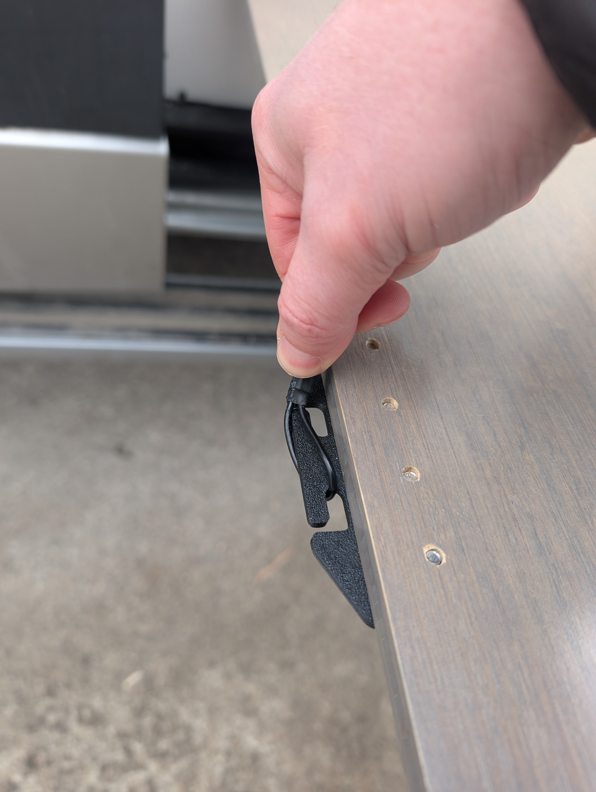
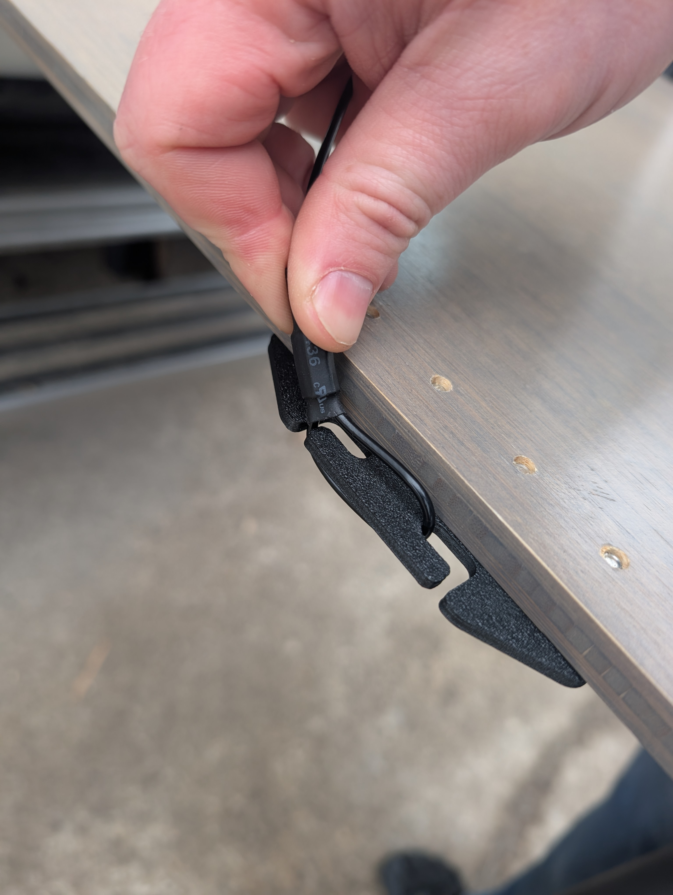
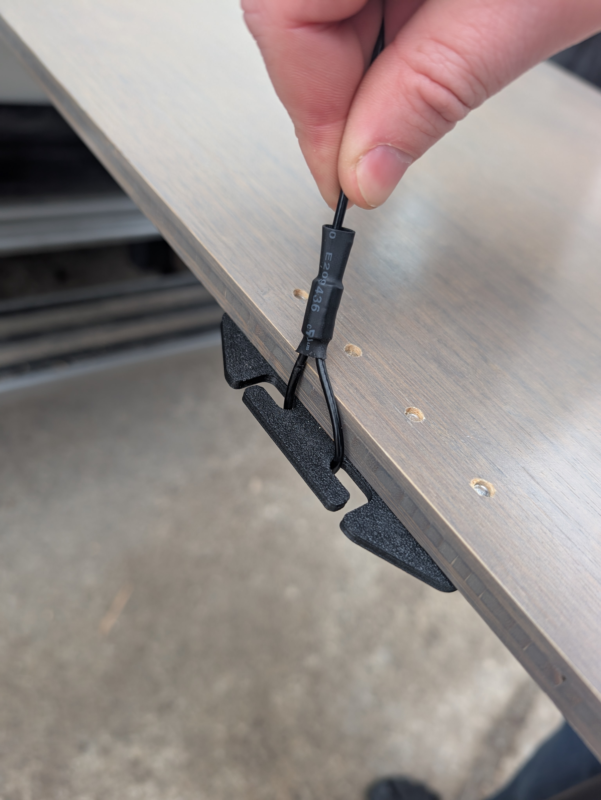

# 2018-2020 Winnebago Revel Suspended Outdoor Table Conversion Install Instructions

### Tools Needed:
- Drill
- Drill Bits
- Drill Stop Bit Collar Set (https://www.amazon.com/dp/B073VS72R3)
- Countersink Drill Bit with Depth Stop
- Hex Key Set
- Mechanical Pencil
- Punch and Hammer
- Painters tape
- Clamps (optional)

### Brackets and fasteners included in the kit:
- 1x - Table Side Bracket
- 1x - Jig (to avoid top side wood tearout)
- 1x - 6 inch L-Track
- 1x - Black Vinyl Coated Suspension Cable
- 6x - Hex-Drive Flat Head Machine Screws
- 6x - Threaded Inserts for Wood

***Be sure to read these instructions thoroughly before beginning***

1. Line the Table Side Bracket up as pictured. The top of the bracket should be 8 7/8 inch from the top of the table. (The table side of the suspension cable will wrap around the left middle of the bracket. We want the cable as close to the table as possible. From the left side of the bracket, the furthest right part of the slot should line up with the left side of the table).
2. Apply some painters tape where the holes will be drilled. This helps to avoid wood tearout.
3. Using a mechanical pencil while holding the bracket in place, mark the perimeter of the first hole in the bracket.
4. Set the bracket to the side, using a punch and a hammer, punch the middle of the first hole.
5. The goal in the next step is to drill about 10mm into the table without drilling through the other side and then slightly countersink the hole opening so that the threaded insert sits flush with the table. Do one hole at a time before proceeding to the next hole. Be sure to install a drill stop on your drill bit. Start with a small drill bit and work your way up. Double check on the side of the table that the drill bit will not drill all the way through the table. To determine the final drill bit size, compare the drill bit diameter to the inner cyclindrical part of the threaded insert. In my experience, the threaded insert should not be hard to thread in, if it is difficult to thread in, you may need to use the next size drill bit to increase the diameter of the hole. Once the threaded insert is flush with the table, stop tightening; if you over tighten, the insert may crack; this does not seem to effect its performance. If you happen to need to remove an insert, it may be possible with an easy-out. Install the first bolt into the bracket, align the bracket again with the left edge of the table and repeat these steps for the next hole.
6. (Optional) Originally I had planned to not drill all the way through the table, but after a short bit of time the top side developed some small cracks. I designed a jig to drill a few relief holes on the top side of the table that will help to avoid the top cracking further. Here is the process: Apply painters tape on the top side, remove the center two bolts, clamp the jig in place, find the drillbit that fits the jig holes, drill the two holes just deep enough to drill through, reinstall the two middle bolts, adjust the clamps, remove the outer two bolts, and repeat the steps.

7. If you purchased our extra large vent that goes on the back side of the kitchen galley, refer to our instructions for that install. The L-Track will bolt through the extra large vent. Otherwise, the L-Track can be installed directly into the back of the kitchen galley. There should be just under 1/4 inch of space between the L-Track and the table. The top of the L-Track should be slightly above the table, just under 1/16 of an inch between the top of the L-Track and the top of the table. Holding the L-Track in place, mark the top hole with a mechanical pencil. Follow the same instructions as the previous step, it is fine for this to drill all the way through, though you may want to use a drill bit stop to make sure you don't drill into anything inside the kitchen galley.
8. Install the suspended cable. The cable is cut and crimped to length to be used on the middle of the L-Track when the van is parked level. The table side of the cable should be a tight fit when connecting to the table bracket. The goal here was to be able to retain the functionality of the original table leg by removing the cable to use both sides of the table when sitting.

9. Steps to install the cord on the table side:

