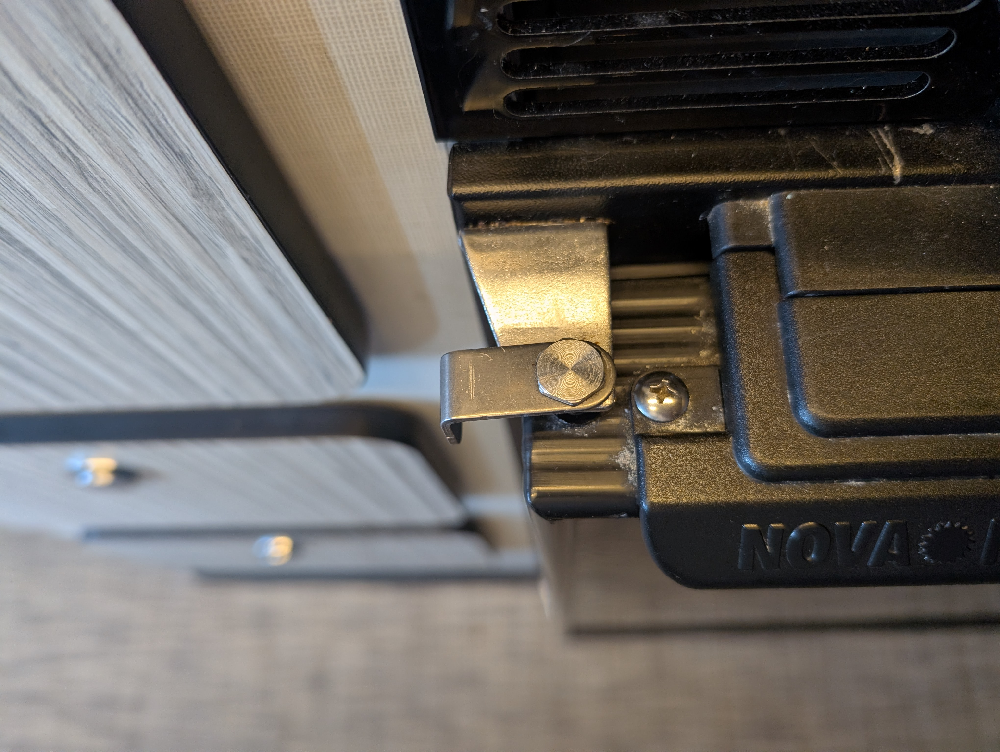
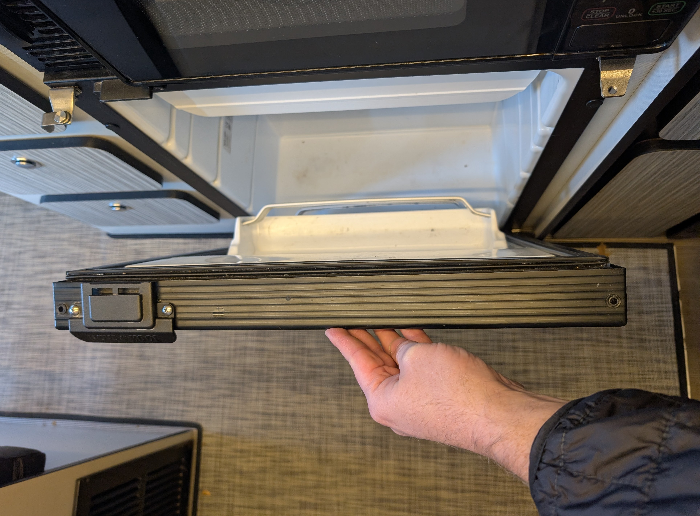
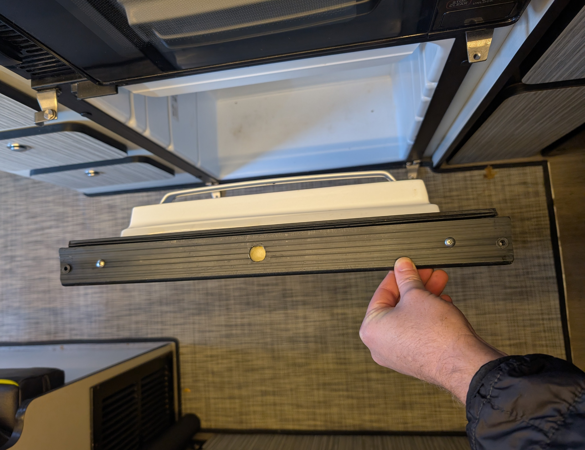
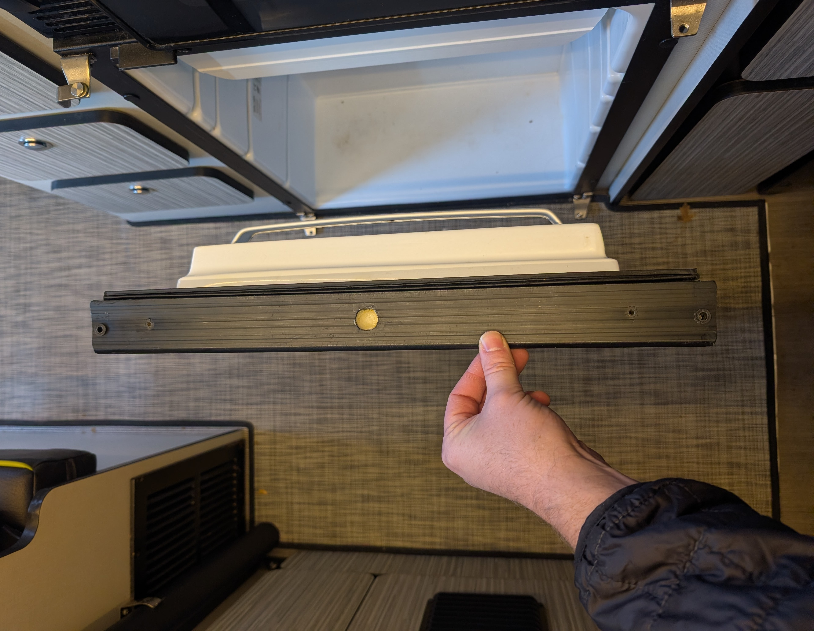
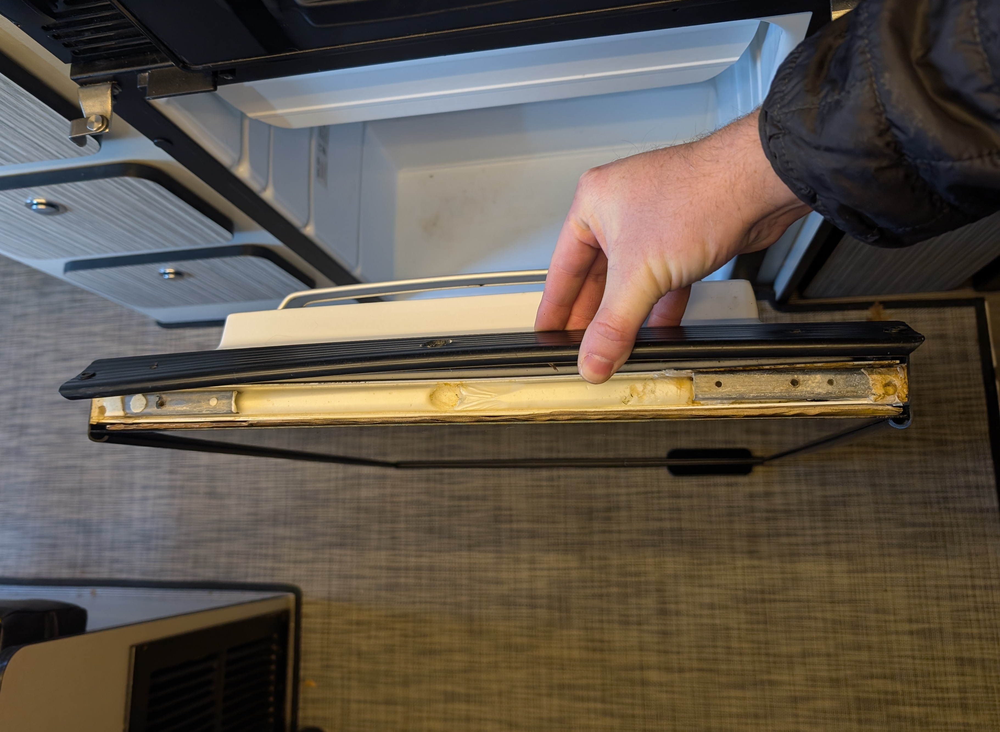
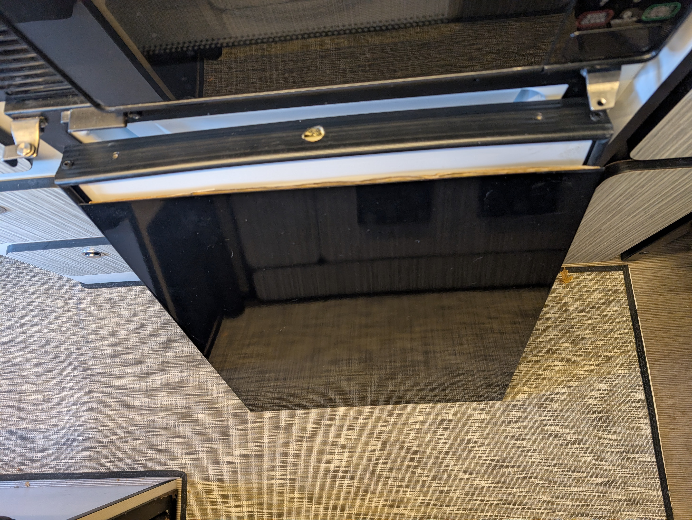

# Gloss Black Magnetic Fridge Front for Nova Kool R3100

### Tools Needed:

- Adjustable Wrench
- Philips screw driver or Impact/Drill with philips bit

### Brackets and fasteners included in the kit:
- 1x - Gloss Black Magnetic Fridge Front

1. Remove fastener from the top right of the fridge door.

2.

3.

4.

5.

6.

7.

