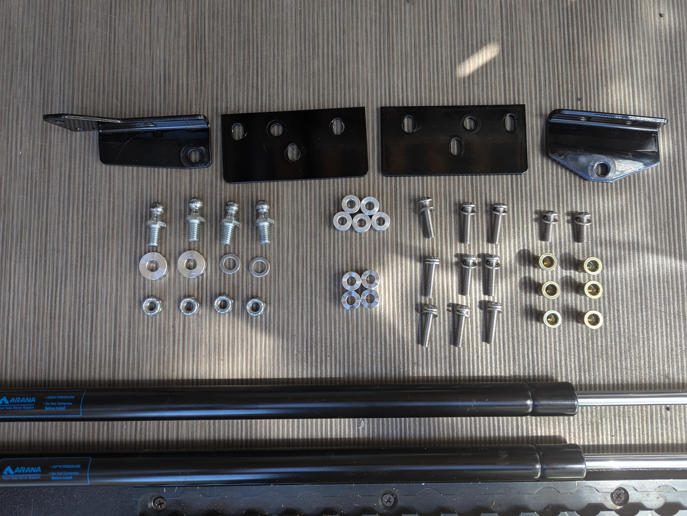

# Mercedes Sprinter NCV3 Rear Door Gas Strut Kit Install Instructions

### Tools Needed:
 
- Drill
- Drill bits (not pictured)
- T30 Torx bit
- 4mm allen wrench
- 1/2 wrench and adjustable wrench (or two 1/2 wrenches)
- Rivet nut install tool
- Oscillating tool
- Small flat head screwdriver (optional: if you need to remove the gas strut after install)
 

### Brackets and fasteners included in the kit:

- Driver door bracket
- Driver body side bracket
- Passenger body side bracket
- Passenger door bracket
- 4x - 10mm ball studs 5/16-18 x 1/2
- 2x - ball stud spacers
- 2x - washers
- 5x - 8mm spacers
- 4x - 10mm spacers
- 9x - M6 x 25 mm cap head allen bolts
- 2x - M6 x 18 mm cap head allen bolts
- 11x - M6 washers
- 6x - M6 rivet nuts
- 2x - gas struts

