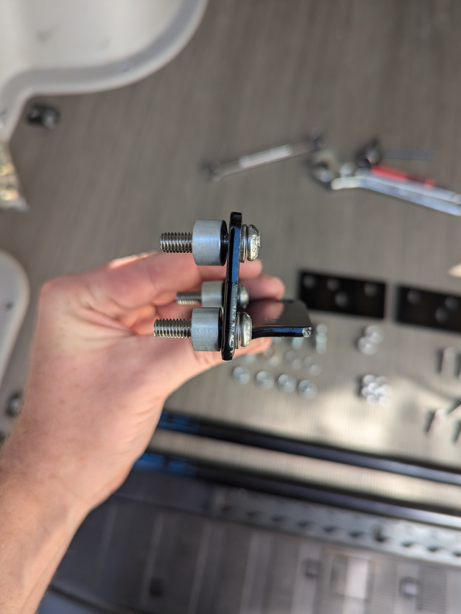
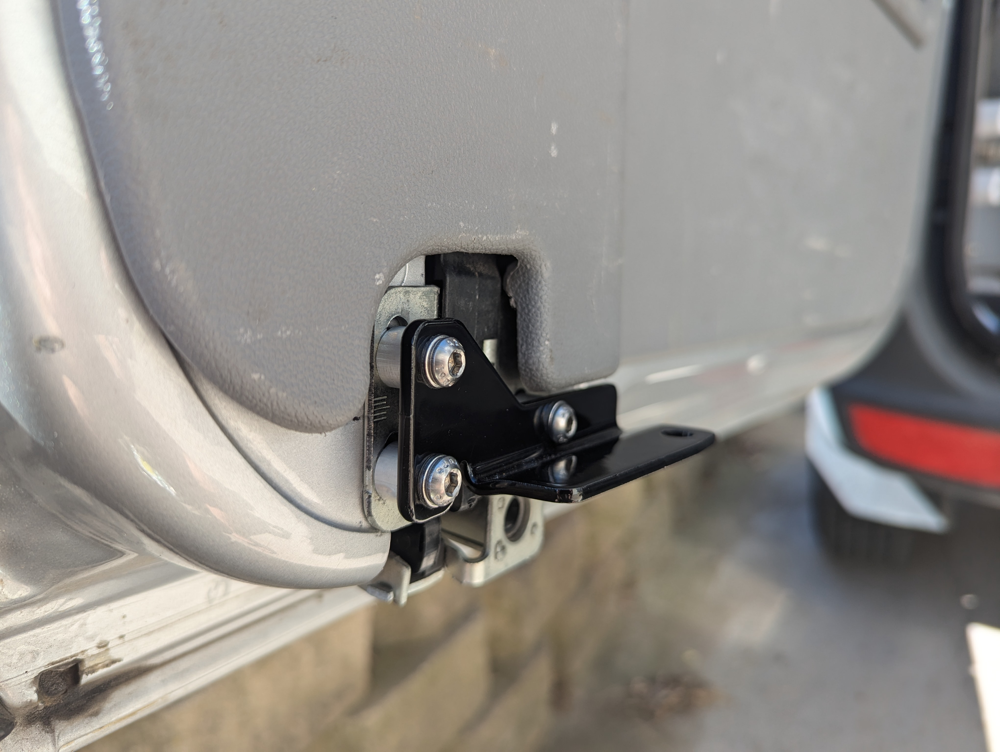
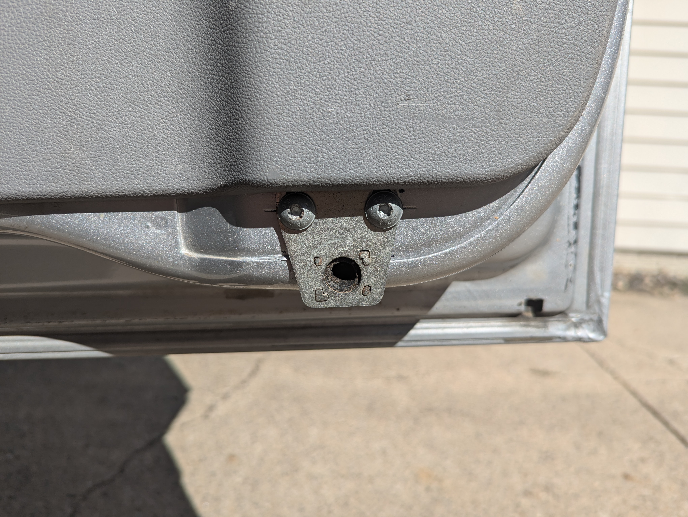
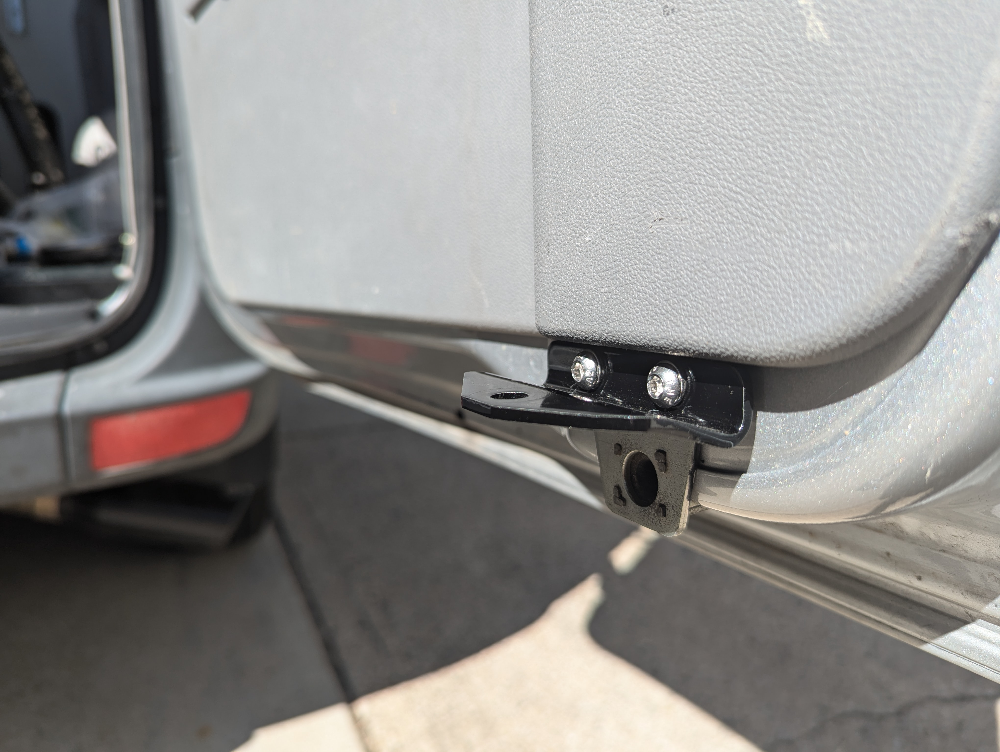

# Mercedes Sprinter NCV3 Rear Door Gas Strut Kit Install Instructions

### Tools Needed:
 
- Drill
- Drill bits (not pictured)
- T30 Torx bit
- 4mm allen wrench
- 1/2 wrench and adjustable wrench (or two 1/2 wrenches)
- Rivet nut install tool
- Oscillating tool
- Small flat head screwdriver (optional: if you need to remove the gas strut after install)
 

### Brackets and fasteners included in the kit:

- Driver door bracket
- Driver body side bracket
- Passenger body side bracket
- Passenger door bracket
- 4x - 10mm ball studs 5/16-18 x 1/2
- 2x - ball stud spacers
- 2x - washers
- 5x - M6 x 8mm spacers
- 4x - M6 x 10mm spacers
- 9x - M6 x 25mm cap head allen bolts
- 2x - M6 x 18mm cap head allen bolts
- 11x - M6 washers
- 6x - M6 rivet nuts
- 2x - gas struts

1. Using a T30 torx bit, remove the 3 torx bolts from the driver door bracket. Let the bracket hang by the cable.

2. Prepare the driver door bracket by installing three M6 x 25mm cap head allen bolts with washers and M6 x 8mm spacers as shown.

3. Install the driver door bracket as shown. Tighten the bolts enough that the factory bracket is held in place, but can move. Close the door completely, allowing the factory bracket to self align using the factory pin on the body side. Open the door and tighten the bolts down further.

4. Install one 10mm ball stud with spacer as shown.

5. Using a T30 torx bit, remove the 2 torx bolts from the passenger door bracket. Temporarily remove the factory bracket.

6. Using 2 M6 x 18mm cap head allen bolts and washers, install the passenger door bracket as shown. Again, tighten the bolts enough that the factory bracket is held in place, but can move. First, close the driver's door completely, then close the passenger door completely, allowing the factory bracket to self align using the factory pin on the body side. Open the door and tighten the bolts down further.

