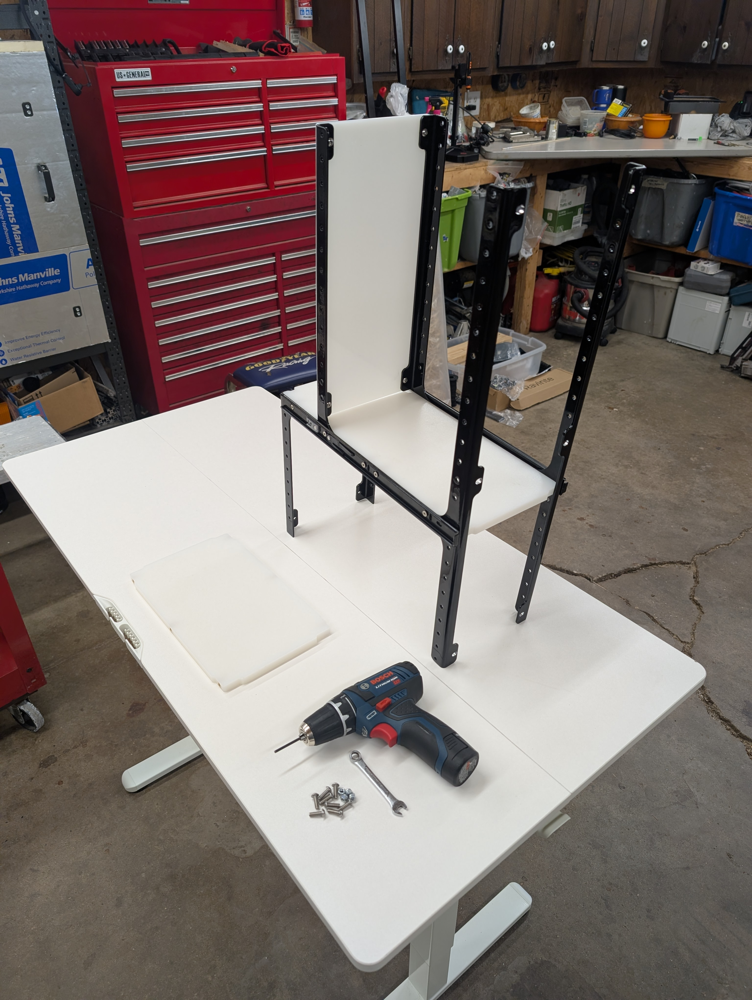
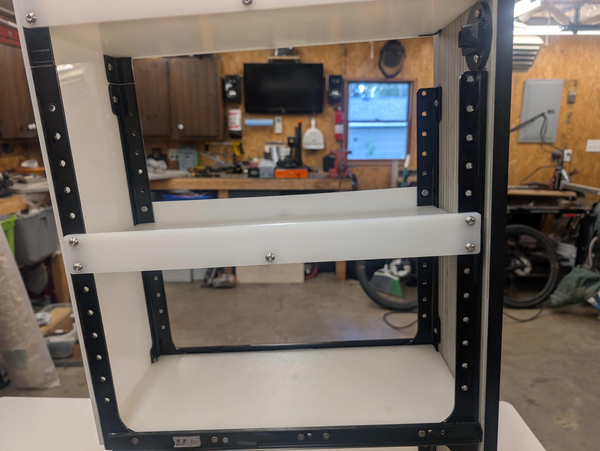

Do you have questions, ideas, or concerns? Feel free to reach out to us on [Facebook Messenger](https://www.facebook.com/BrobstonCreationsLLC) or by Email (brobstoncreations@gmail.com).

# 2019 Winnebago Revel Slideout Pantry Install Instructions

### While this kit can be installed yourself, for best results we recommend having it professionally installed.

### Tools Needed:

### Brackets and fasteners included in the kit:

### Not included in the kit:
- Loctite (not necessary, but can be used)

## Installation:
There are six main steps:
1. Assemble pantry drawer
2. Deconstruct original pantry.
3. Use the provided jig to create the holes for the drawer slides.
4. Install and shim drawer slides.
5. Install frame replacement trim.
6. Install pantry drawer.

There are a handful of steps that are very similar, in the first iteration I will describe the whole process and these steps will be repeated but I will omit the lengthy description.

### Assemble pantry drawer
1. Locate ten M4 flat head machine screws, two of the drawer side inserts from the drawer slides, the lower front right, lower front left, lower back right, and lower back left black frame pieces.

2. The black metal frame pieces will be sandwhiched between the drawer slide and the shelf. The textured side of the shelf is intended to be facing up. From the outside in it is: bolt -> drawer slide -> metal frame -> shelf. I have not had any issues, but if you wish you can add blue loctite to these bolts to ensure they don't rattle loose.

3. Flip this assembly 180 degrees horizontally and assemble the opposite side the same way.

4. Flip the assembly so that the back side is facing down.

5. Using four 8mm long M5 button head machine screws, install the 1/2 thick lower back cover.

6. Using five 15mm long M5 button head machine screws and two M5 locknuts, install the lowest shelf as pictured. Three bolts are inserted into the threaded inserts in the shelves and two bolts are retained by locknuts installed from the other side.

7. Flip this assembly 180 degrees horizontally.

8. Use seven 5mm long M5 button head machine screws and four M5 locknuts, install the lower section right side cover. Three bolts are inserted into the threaded inserts in the shelves and four bolts are retained by locknuts installed from the other side.

9. Set this lower assembly to the side.
10. Locate ten M4 flat head machine screws, two of the drawer side inserts from the drawer slides, the upper front right, upper front left, upper back right, and upper back left black frame pieces.

11. Using the same steps as the lower assembly, assemble the upper assembly.

12. Flip this assembly so that the front is facing down.

