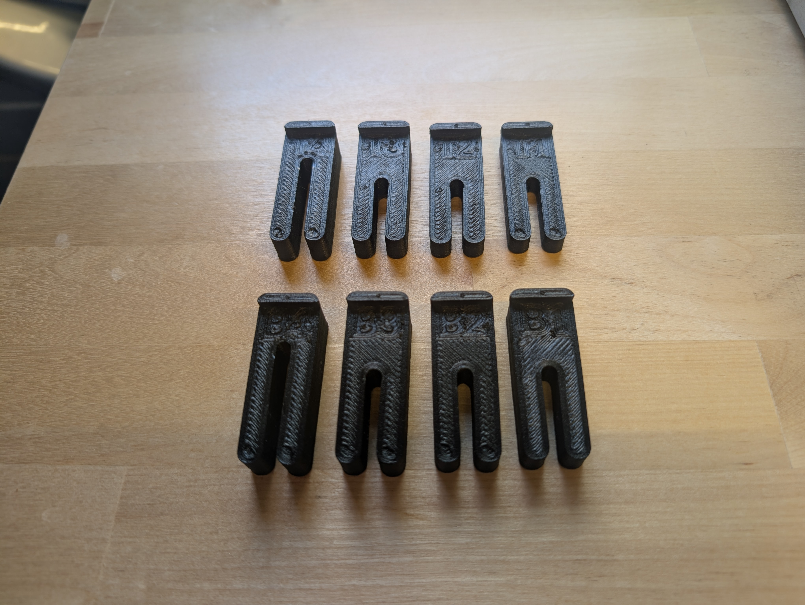
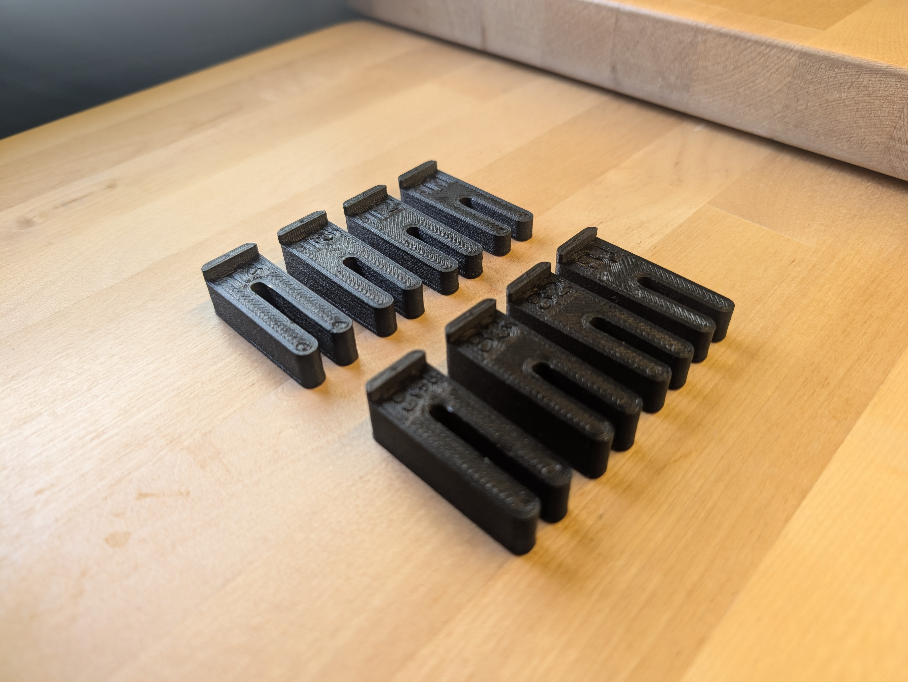

### 7. Measure shim spacing

While shims likely will work file, especially if you were to drill through them and then cut them to size, we would prefer to offer a more refined solution. We still need the same spacing, but wouldn't it look so much better if it was as minimal as possible so that it blended in and the spacer was labeled? With maintenance in mind, it would be nice to be able to remove all of this and have the process to reassembly be as frictionless as possible.


1. While holding the shims in place, use a writing utensil to mark across the two shims so that once they are removed you can realign them to take a measurement of the thickness.


2. Using digial calipers, measure the thickness of the overlapped section as pictured.


3. Repeat this for all shims. Front to back is labelled 1 through 4. You can copy/paste the text below and then fill the values in and send this information to us via email (brobstoncreations@gmail.com) and we'll make the spacers and send them to you in the mail.
```text
Thickness Measurements
Top 4:
Top 3:
Top 2:
Top 1:
Bottom 4:
Bottom 3:
Bottom 2:
Bottom 1:
```

Once you receive these you can loosen the screws, insert the new spacers, and retighten the screws.






