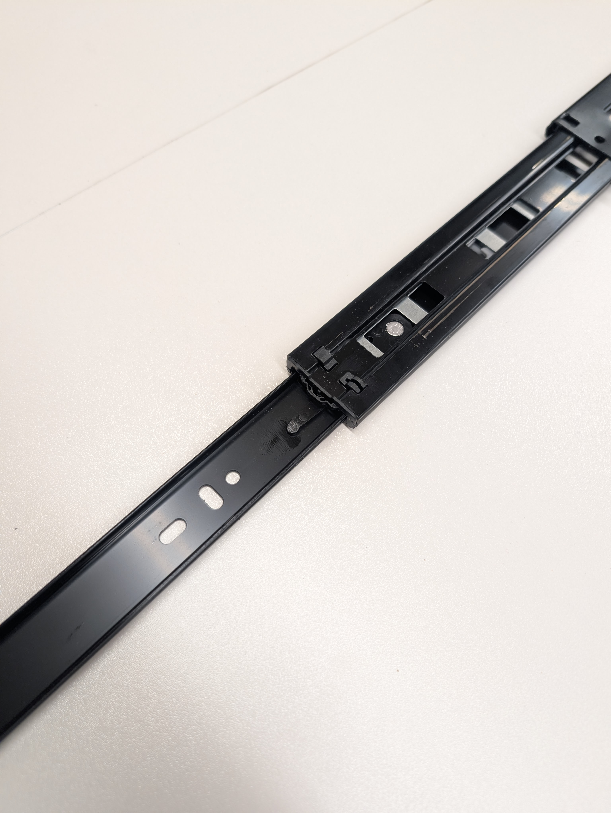
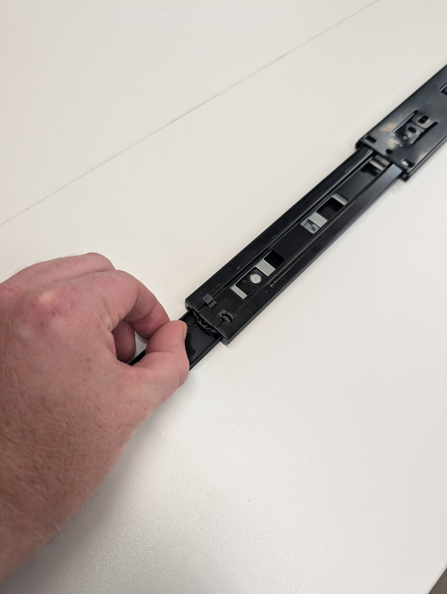
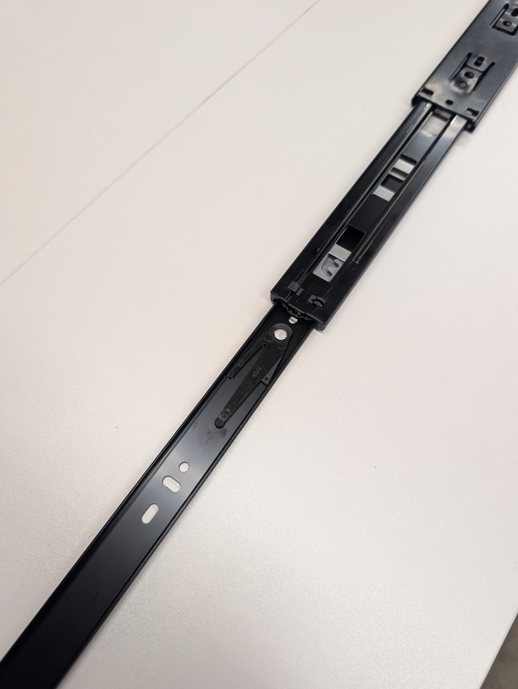
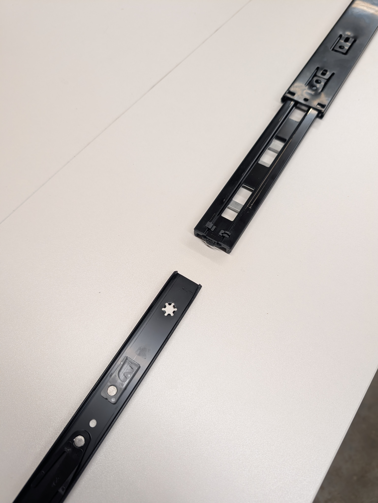

These drawer slides release into two sections. With the drawer slide fully extended you will find a small plastic tab, if you press this tab the correct direction it will allow you to release the drawer side of the slide from the cabinet side of the slide. Reconnecting the two back together is as simple as sliding the drawer side of the slide into the cabinet side of the slide.

